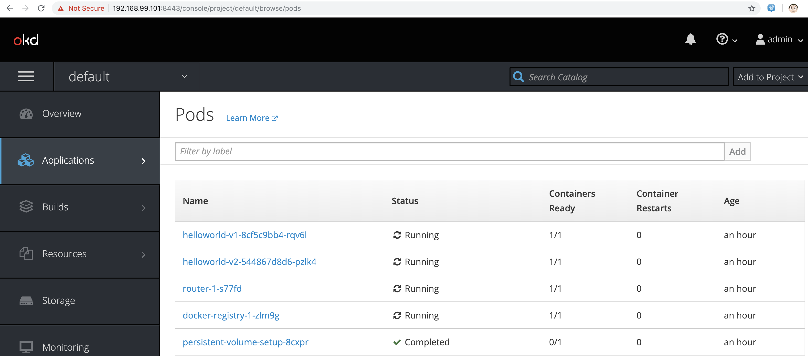
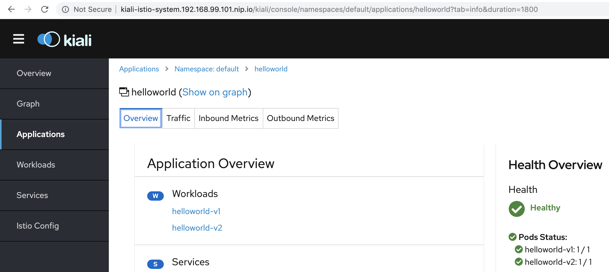

== Istio 1.4.0 on OpenShift 3.11 / Minishift 

----
minishift version
minishift v1.34.1+c2ff9cb
----

----
istioctl version
client version: 1.4.0
control plane version: 1.4.0
data plane version: 1.4.0 (1 proxies)
----

----
minishift profile set tutorial
minishift config set memory 10GB
minishift config set cpus 4
minishift config set vm-driver virtualbox
minishift config set image-caching true
minishift addon enable admin-user
minishift addon enable anyuid
minishift config set openshift-version v3.11.0
minishift start
----

----
eval $(minishift oc-env)
oc login $(minishift ip):8443 -u admin -p admin
----

----
Remove system:authenticated from anyuid scc
oc edit scc anyuid
----

----
curl -LO "https://storage.googleapis.com/kubernetes-release/release/$(curl -s https://storage.googleapis.com/kubernetes-release/release/stable.txt)/bin/darwin/amd64/kubectl"

sudo cp ./kubectl /usr/local/bin

sudo chmod +x /usr/local/bin/kubectl
----

----
minishift openshift config set --target=kube --patch '{
        "admissionConfig": {
            "pluginConfig": {
                "ValidatingAdmissionWebhook": {
                    "configuration": {
                        "apiVersion": "v1",
                        "kind": "DefaultAdmissionConfig",
                        "disable": false
} },
                "MutatingAdmissionWebhook": {
                    "configuration": {
                        "apiVersion": "v1",
                        "kind": "DefaultAdmissionConfig",
                        "disable": false
} }
} }
}'
----

----
oc new-project istio-system
----

----
export GRAFANA_USERNAME=$(echo -n "grafana" | base64)
export GRAFANA_PASSPHRASE=$(echo -n "REPLACE_WITH_YOUR_SECURE_PASSWORD" | base64)

cat <<EOF | kubectl apply -f -
apiVersion: v1
kind: Secret
metadata:
  name: grafana
  namespace: istio-system
  labels:
    app: grafana
type: Opaque
data:
  username: $GRAFANA_USERNAME
  passphrase: $GRAFANA_PASSPHRASE
EOF
----

----
KIALI_USERNAME=$(echo -n "kiali" | base64)
KIALI_PASSPHRASE=$(echo -n "REPLACE_WITH_YOUR_SECURE_PASSWORD" | base64)

cat <<EOF | kubectl apply -f -
apiVersion: v1
kind: Secret
metadata:
  name: kiali
  namespace: istio-system
  labels:
    app: kiali
type: Opaque
data:
  username: $KIALI_USERNAME
  passphrase: $KIALI_PASSPHRASE
EOF
----

----
oc patch scc/privileged --patch {\"allowedCapabilities\":[\"NET_ADMIN\"]}
----

----
oc adm policy add-scc-to-user anyuid system:serviceaccount:istio-system:istio-ingress-service-account
oc adm policy add-scc-to-user anyuid system:serviceaccount:istio-system:default
oc adm policy add-scc-to-user anyuid system:serviceaccount:istio-system:grafana
oc adm policy add-scc-to-user anyuid system:serviceaccount:istio-system:prometheus
oc adm policy add-scc-to-user anyuid system:serviceaccount:istio-system:istio-egressgateway-service-account
oc adm policy add-scc-to-user anyuid system:serviceaccount:istio-system:istio-citadel-service-account
oc adm policy add-scc-to-user anyuid system:serviceaccount:istio-system:istio-ingressgateway-service-account
oc adm policy add-scc-to-user anyuid system:serviceaccount:istio-system:istio-cleanup-old-ca-service-account
oc adm policy add-scc-to-user anyuid system:serviceaccount:istio-system:istio-mixer-post-install-account
oc adm policy add-scc-to-user anyuid system:serviceaccount:istio-system:istio-mixer-service-account
oc adm policy add-scc-to-user anyuid system:serviceaccount:istio-system:istio-pilot-service-account
oc adm policy add-scc-to-user anyuid system:serviceaccount:istio-system:istio-sidecar-injector-service-account
oc adm policy add-scc-to-user anyuid system:serviceaccount:istio-system:istio-galley-service-account
oc adm policy add-scc-to-user anyuid system:serviceaccount:istio-system:istio-multi
oc adm policy add-scc-to-user anyuid system:serviceaccount:istio-system:builder
oc adm policy add-scc-to-user anyuid system:serviceaccount:istio-system:deployer
oc adm policy add-scc-to-user anyuid system:serviceaccount:istio-system:istio-cleanup-secrets-service-account
oc adm policy add-scc-to-user anyuid system:serviceaccount:istio-system:istio-grafana-post-install-account
oc adm policy add-scc-to-user anyuid system:serviceaccount:istio-system:istio-security-post-install-account
oc adm policy add-scc-to-user anyuid system:serviceaccount:istio-system:kiali-service-account

oc adm policy add-cluster-role-to-user admin system:serviceaccount:istio-system:kiali-service-account -z default

oc adm policy add-scc-to-user anyuid -z istio-egressgateway-service-account -n istio-system
oc adm policy add-scc-to-user anyuid -z istio-citadel-service-account -n istio-system
oc adm policy add-scc-to-user anyuid -z istio-ingressgateway-service-account -n istio-system
oc adm policy add-scc-to-user anyuid -z istio-cleanup-old-ca-service-account -n istio-system
oc adm policy add-scc-to-user anyuid -z istio-mixer-post-install-account -n istio-system
oc adm policy add-scc-to-user anyuid -z istio-mixer-service-account -n istio-system
oc adm policy add-scc-to-user anyuid -z istio-pilot-service-account -n istio-system
oc adm policy add-scc-to-user anyuid -z istio-sidecar-injector-service-account -n istio-system

oc adm policy add-scc-to-user anyuid -z istio-egressgateway-service-account -n istio-system
oc adm policy add-scc-to-user anyuid -z istio-citadel-service-account -n istio-system
oc adm policy add-scc-to-user anyuid -z istio-ingressgateway-service-account -n istio-system
oc adm policy add-scc-to-user anyuid -z istio-cleanup-old-ca-service-account -n istio-system
oc adm policy add-scc-to-user anyuid -z istio-mixer-post-install-account -n istio-system
oc adm policy add-scc-to-user anyuid -z istio-mixer-service-account -n istio-system
oc adm policy add-scc-to-user anyuid -z istio-pilot-service-account -n istio-system
oc adm policy add-scc-to-user anyuid -z istio-galley-service-account -n istio-system
oc adm policy add-scc-to-user anyuid -z istio-policy-service-account -n istio-system
oc adm policy add-scc-to-user anyuid -z istio-sidecar-injector-service-account -n istio-system
----

----
curl -L https://github.com/istio/istio/releases/download/1.4.0/istio-1.4.0-osx.tar.gz -o istio140.tar.gz
tar -xvzf istio140.tar.gz
cd istio-1.4.0/
sudo cp ./bin/istioctl /usr/local/bin
istioctl manifest apply --set profile=demo --set cni.enabled=true
----

----
oc label namespace default istio-injection=enabled
namespace/default labeled
----

----
curl -L https://raw.githubusercontent.com/marcredhat/minishift/master/istio/IstioControlPlaneProfile.yaml -o IstioControlPlaneProfile.yaml

istioctl manifest apply -f IstioControlPlaneProfile.yaml
----

----
oc get pods -n istio-system
NAME                                      READY     STATUS    RESTARTS   AGE
grafana-964fdb684-hpd2p                   1/1       Running   0          15s
istio-citadel-5d69bfffd9-kskvt            1/1       Running   0          5m
istio-galley-7d65cbd5bb-q7rng             2/2       Running   0          2m
istio-ingressgateway-d578c9d94-p92c7      1/1       Running   0          2m
istio-pilot-95ff8f878-6jsrp               2/2       Running   0          1m
istio-policy-cdd87fcd-42vtj               2/2       Running   0          1m
istio-sidecar-injector-585d8644b7-7dq52   1/1       Running   0          5m
istio-telemetry-865f5f7957-zfx4x          2/2       Running   0          1m
istio-tracing-75cdd6c6b8-992rh            1/1       Running   0          5m
kiali-68b88fff8f-kvb68                    1/1       Running   0          5m
prometheus-67698bcb6f-4r228               1/1       Running   0          1m
----

----
oc project default
----

----
oc apply -f samples/helloworld/helloworld.yaml
service/helloworld created
deployment.apps/helloworld-v1 created
deployment.apps/helloworld-v2 created
----

----
oc apply -f samples/helloworld/helloworld-gateway.yaml
unable to recognize "samples/helloworld/helloworld-gateway.yaml": no matches for kind "Gateway" in version "networking.istio.io/v1alpha3"
unable to recognize "samples/helloworld/helloworld-gateway.yaml": no matches for kind "VirtualService" in version "networking.istio.io/v1alpha3
----

----
Hmmm, it seems that Gateway and VirtualService CRDs are not present in 1.4.0.

Let's get them from 1.2.0.

curl -L https://github.com/istio/istio/releases/download/1.2.0/istio-1.2.0-osx.tar.gz -o istio120.tar.gz
tar -xvzf istio120.tar.gz
cd istio-1.2.0/

for i in install/kubernetes/helm/istio-init/files/crd*yaml; do kubectl apply -f $i; done
----

----
Go back to the istio-1.4.0 directory and try again
cd ..
oc apply -f samples/helloworld/helloworld-gateway.yaml
oc apply -f samples/helloworld/helloworld-gateway.yaml

gateway.networking.istio.io/helloworld-gateway created
virtualservice.networking.istio.io/helloworld created

OK, so this worked.
----

----
istioctl x analyze -k -n default
Warn [IST0102] (Namespace default) The namespace is not enabled for Istio injection. Run 'kubectl label namespace default istio-injection=enabled' to enable it, or 'kubectl label namespace default istio-injection=disabled' to explicitly mark it as not needing injection
Error: Analyzer found issues.
----

----
istioctl x analyze -k -n default
Warn [IST0103] (Pod docker-registry-1-dpgfr.default) The pod is missing its Istio proxy. Run 'kubectl delete pod docker-registry-1-dpgfr -n default' to restart it
Warn [IST0103] (Pod helloworld-v1-8cf5c9bb4-vnm2k.default) The pod is missing its Istio proxy. Run 'kubectl delete pod helloworld-v1-8cf5c9bb4-vnm2k -n default' to restart it
Warn [IST0103] (Pod helloworld-v2-544867d8d6-qbzng.default) The pod is missing its Istio proxy. Run 'kubectl delete pod helloworld-v2-544867d8d6-qbzng -n default' to restart it
Warn [IST0103] (Pod persistent-volume-setup-stkgb.default) The pod is missing its Istio proxy. Run 'kubectl delete pod persistent-volume-setup-stkgb -n default' to restart it
Warn [IST0103] (Pod router-1-l97w9.default) The pod is missing its Istio proxy. Run 'kubectl delete pod router-1-l97w9 -n default' to restart it
----

----
oc delete pod docker-registry-1-dpgfr -n default
oc delete pod helloworld-v1-8cf5c9bb4-vnm2k -n default
oc delete pod helloworld-v2-544867d8d6-qbzng -n default
oc delete pod persistent-volume-setup-stkgb -n default
oc delete pod router-1-l97w9 -n default
----

----
oc project default
Already on project "default" on server "https://192.168.99.101:8443".
----

----
oc get pods
NAME                             READY     STATUS      RESTARTS   AGE
docker-registry-1-zlm9g          1/1       Running     0          28m
helloworld-v1-8cf5c9bb4-rqv6l    1/1       Running     0          5m
helloworld-v2-544867d8d6-pzlk4   1/1       Running     0          5m
persistent-volume-setup-8cxpr    0/1       Completed   0          28m
router-1-s77fd                   1/1       Running     0          28m
----

----
oc describe Gateway
MacBook-Pro:istio-1.4.0 marcchisinevski$ oc describe Gateway
Name:         helloworld-gateway
Namespace:    default
Labels:       <none>
Annotations:  kubectl.kubernetes.io/last-applied-configuration={"apiVersion":"networking.istio.io/v1alpha3","kind":"Gateway","metadata":{"annotations":{},"name":"helloworld-gateway","namespace":"default"},"spec":{"...
API Version:  networking.istio.io/v1alpha3
Kind:         Gateway
Metadata:
  Creation Timestamp:  2019-11-27T07:54:12Z
  Generation:          1
  Resource Version:    12332
  Self Link:           /apis/networking.istio.io/v1alpha3/namespaces/default/gateways/helloworld-gateway
  UID:                 19deadd9-10eb-11ea-96a3-08002751cd28
Spec:
  Selector:
    Istio:  ingressgateway
  Servers:
    Hosts:
      *
    Port:
      Name:      http
      Number:    80
      Protocol:  HTTP
Events:          <none>
----

----
oc describe VirtualService
Name:         helloworld
Namespace:    default
Labels:       <none>
Annotations:  kubectl.kubernetes.io/last-applied-configuration={"apiVersion":"networking.istio.io/v1alpha3","kind":"VirtualService","metadata":{"annotations":{},"name":"helloworld","namespace":"default"},"spec":{"g...
API Version:  networking.istio.io/v1alpha3
Kind:         VirtualService
Metadata:
  Creation Timestamp:  2019-11-27T07:54:12Z
  Generation:          1
  Resource Version:    12333
  Self Link:           /apis/networking.istio.io/v1alpha3/namespaces/default/virtualservices/helloworld
  UID:                 19e09444-10eb-11ea-96a3-08002751cd28
Spec:
  Gateways:
    helloworld-gateway
  Hosts:
    *
  Http:
    Match:
      Uri:
        Exact:  /hello
    Route:
      Destination:
        Host:  helloworld
        Port:
          Number:  5000
Events:            <none>
----

----
Note (see VirtualService above) that we are matching on URI "/hello"
----

----
oc  get svc istio-ingressgateway -n istio-system
NAME                   TYPE           CLUSTER-IP       EXTERNAL-IP                   PORT(S)                                                                                                                                      AGE
istio-ingressgateway   LoadBalancer   172.30.199.207   172.29.176.65,172.29.176.65   15020:30409/TCP,80:31175/TCP,443:31390/TCP,31400:31400/TCP,15029:31636/TCP,15030:31416/TCP,15031:30086/TCP,15032:30817/TCP,15443:31868/TCP   1h
----

----
Note (see istio-ingressgateway LoadBalancer above) 80:31175
----

----
minishift ip
192.168.99.101
----

We can browse to http://192.168.99.101:31175 

Hello version v1 

Refresh http://192.168.99.101:31175

Hello version v2

----
minishift dashboard

We can browse to the OpenShift 3.11 dashboard at https://192.168.99.101:8443/console

(Replace 192.168.99.101 with the value returned by "minishift ip")
----

== Kiali

----
oc project default
istioctl kube-inject -f samples/helloworld/helloworld.yaml  | oc apply -f -
service/helloworld unchanged
deployment.apps/helloworld-v1 configured
deployment.apps/helloworld-v2 configured
----

----
oc expose svc kiali -n istio-system
minishift openshift service kiali --in-browser
----

----
minishift ip
192.168.99.101
----

----
oc  get svc istio-ingressgateway -n istio-system
NAME                   TYPE           CLUSTER-IP      EXTERNAL-IP                   PORT(S)                                                                                                                      AGE
istio-ingressgateway   LoadBalancer   172.30.78.141   172.29.117.22,172.29.117.22   15020:32687/TCP,80:31175/TCP,443:32246/TCP,15029:31994/TCP,15030:32020/TCP,15031:32439/TCP,15032:31592/TCP,15443:30556/TCP   11h
----

----
When you deploy an application into a Service Mesh running in an OpenShift environment, 
it is necessary to relax the security constraints placed on the application by 
its service account to ensure the application can function correctly. 

Each service account must be granted permissions with the anyuid and privileged 
Security Context Constraints (SCC) to enable the sidecars to run correctly.

The privileged SCC is required to ensure changes to the pod’s networking configuration
is updated successfully with the istio-init initialization container and
the anyuid SCC is required to enable the sidecar container to run with its required user id of 1337.

To configure the correct permissions it is necessary to 
identify the service accounts being used by your application’s pods. 

For most applications, this will be the default service account, 
however your Deployment/DeploymentConfig may override this within the pod specification by providing the serviceAccountName.

Example:
istioctl kube-inject -f samples/sleep/sleep.yaml  | oc apply -f -
oc adm policy add-scc-to-user anyuid -z sleep -n default 
oc adm policy add-scc-to-user privileged -z sleep -n default 
----

----
NOTE: On CodeReady Containers / OpenShift 4.2+
istioctl x analyze -k
wget https://raw.githubusercontent.com/marcredhat/minishift/master/istio/helloworldinject.yaml
istioctl kube-inject -f ./helloworldinject.yaml  | oc apply -f -
----
